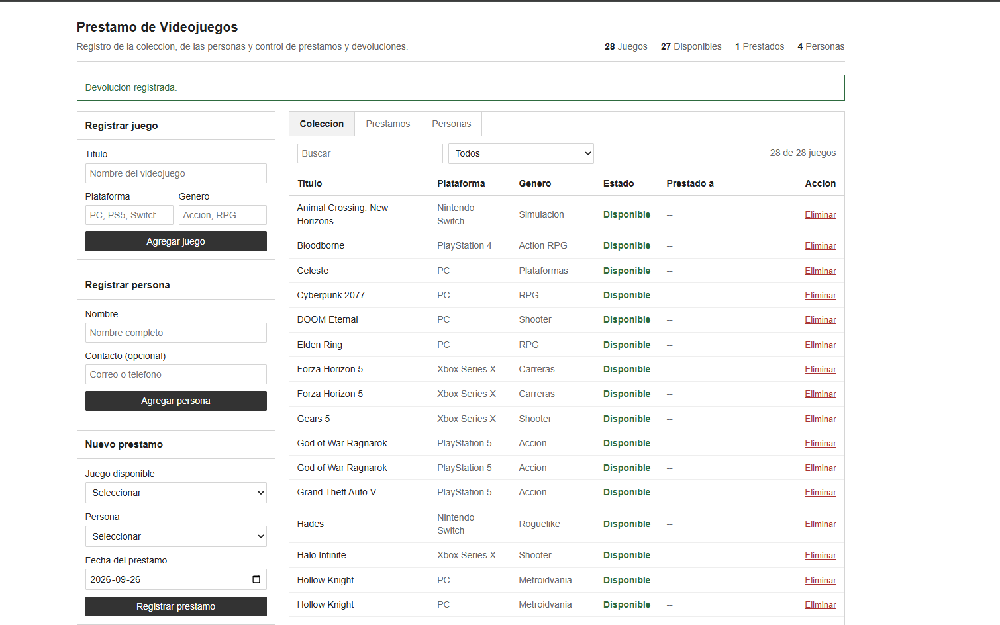
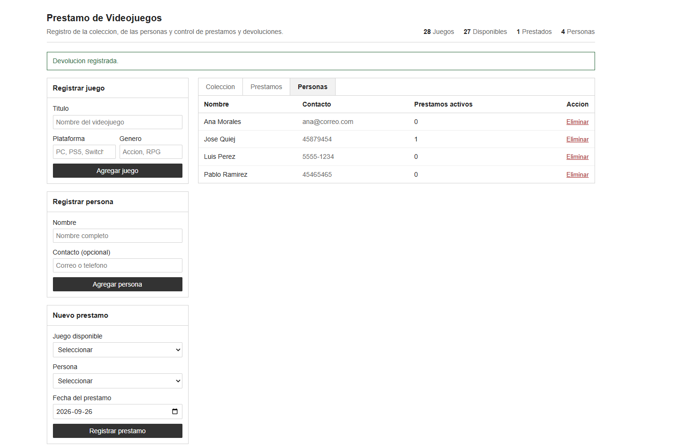
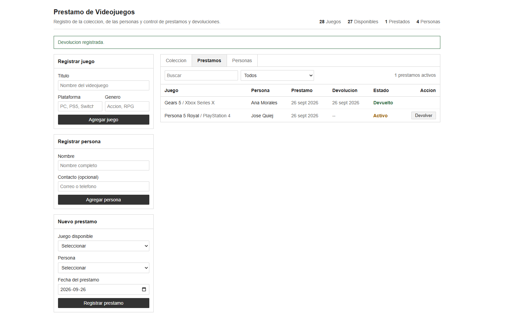
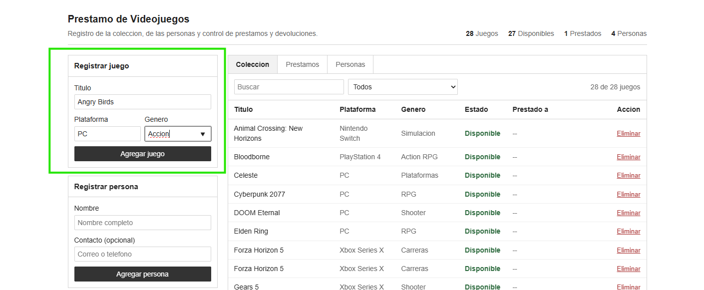
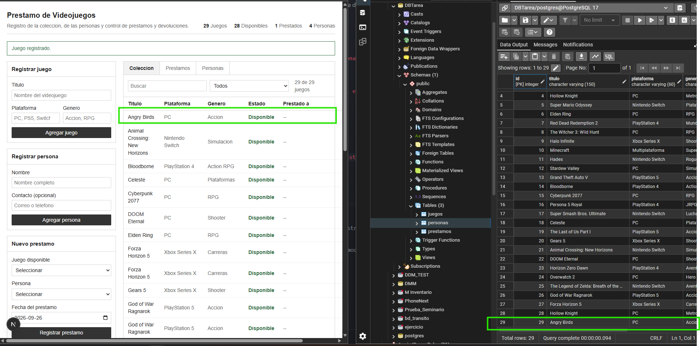
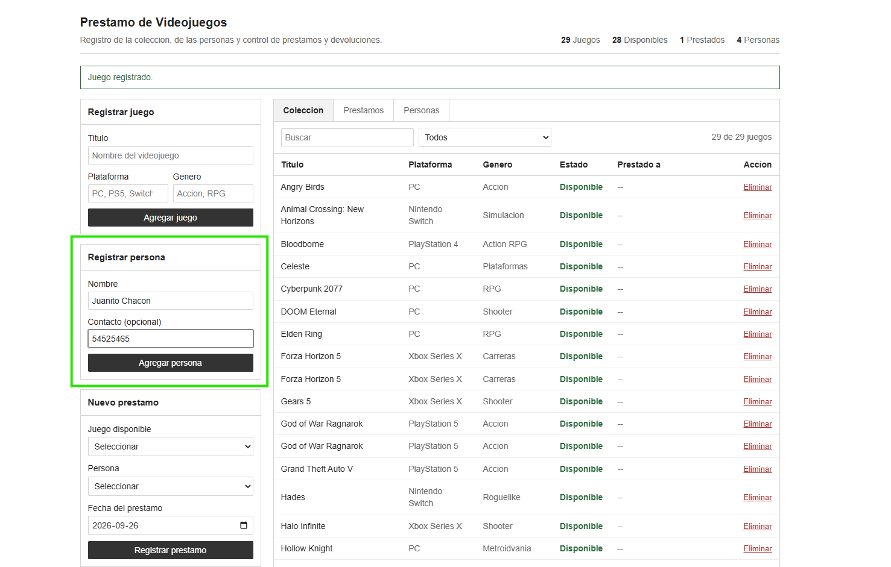
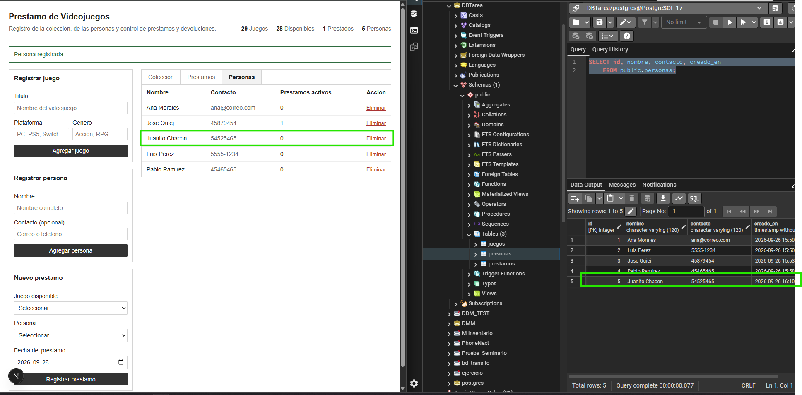
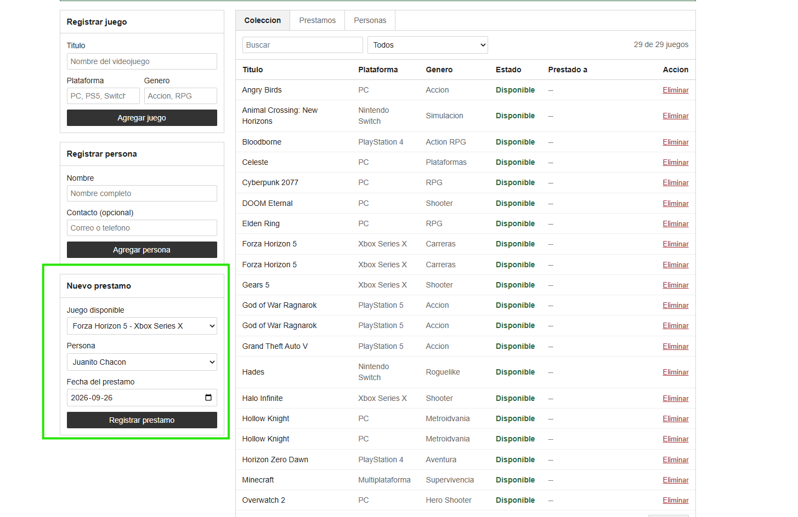
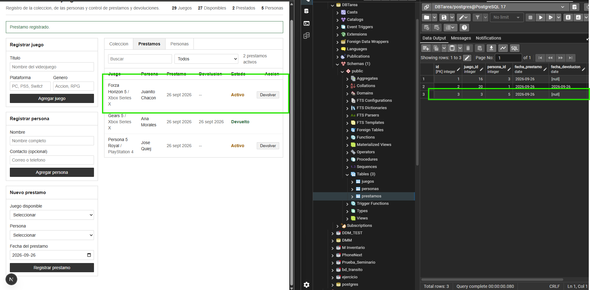
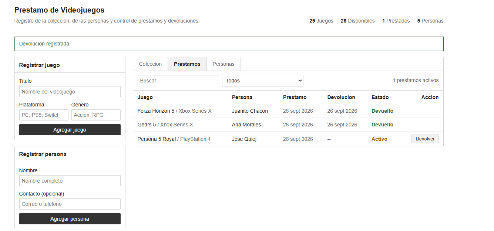

# Ejercicio 4 Prestamo de Videojuegos
# José Pablo Quiej Ramirez 1190-22-6422

# Capturas de funcionamiento 
# Pantalla principal

# Apartado donde se ve agregado a las personas 

# Apartado del registro de prestamos con el estado del mismo

# Apartado de agregar nuevo juego

# se verifica que esta se agrega en BD y Vista de usuario

# se registra una nueva persona 

# se verifica que añada en la BD y la vista del usuario 

# se agrega un nuevo prestamo 

# se verifica que se creara el Prestamo

# se verfica que se realizara la devolucion del prestamo 

